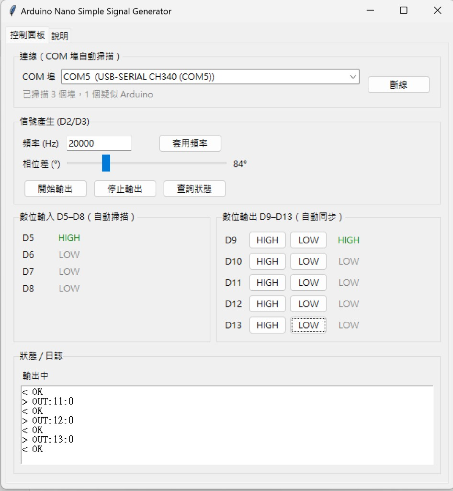

# Arduino Nano Simple Signal Generator

以 Arduino Nano 產生兩路可調頻率、可調相位差的方波（D2、D3），並提供 D5–D8 輸入偵測、D9–D13 輸出控制；由 Serial 接收指令，Python GUI 遠端操作。

## 主畫面



## 文件索引

| 文件 | 內容 |
|------|------|
| [README.md](README.md) | 專案概覽（本文件） |
| [DEVELOPMENT.md](DEVELOPMENT.md) | 開發環境、建置燒錄、測試指令、開發歷程 |
| [CLI.md](CLI.md) | **Serial CLI 控制指令完整手冊** |

## 系統架構

```
┌─────────────────┐    USB/UART     ┌──────────────────┐
│  Python GUI     │ ◄──────────────►│  Arduino Nano    │
│  (pyserial)     │   115200 baud   │  Timer1 ISR      │
└─────────────────┘                 │  D2/D3 → 方波    │
                                    │  D5-D8 → 輸入    │
                                    │  D9-D13 → 輸出   │
                                    └────────┬─────────┘
                                             │
                                    ┌────────▼─────────┐
                                    │  DUT AND Gate    │
                                    │  A,B → 輸入      │
                                    │  Y  → 示波器量測 │
                                    └──────────────────┘
```

## 硬體需求

| 項目 | 規格 |
|------|------|
| 主控板 | **Arduino Nano**（ATmega328P，16 MHz） |
| Bootloader | **ATmega328P (Old Bootloader)** |
| 通訊 | Serial（USB），115200 baud |

### 腳位配置

| 腳位 | 功能 |
|------|------|
| D2 | 信號 A（方波輸出） |
| D3 | 信號 B（方波輸出，可調相位） |
| D5–D8 | 數位輸入 |
| D9–D13 | 數位輸出（CLI / GUI 控制） |

### 接線示意

```
Nano D2 ──► AND Gate Pin A
Nano D3 ──► AND Gate Pin B
Nano GND ─┴─ AND Gate GND
AND Gate Y ──► 示波器 CH1
```

## 技術規格

| 參數 | 範圍 / 說明 |
|------|-------------|
| 目標頻率 | **20 kHz**（預設），可調 |
| 頻率範圍 | 約 10 Hz ~ 80 kHz |
| 相位差 | 0° ~ 360°（拖曳滑桿即時更新） |
| 占空比 | 固定 50% 方波 |

### 相位解析度（自適應）

| 頻率 | 步數/週期 | 相位解析度 |
|------|-----------|------------|
| 1 kHz | 80 | 4.5° |
| 10 kHz | 8 | 45° |
| **20 kHz** | **4** | **90°** |
| 50 kHz | 2 | 180° |

## Serial CLI 快速參考

詳見 [CLI.md](CLI.md)。

| 指令 | 說明 |
|------|------|
| `FREQ:<hz>` | 設定頻率 |
| `PHASE:<deg>` | 設定相位 |
| `START` / `STOP` | 開始 / 停止方波 |
| `STATUS?` | 查詢波形狀態 |
| `IN?` | 讀取 D5–D8 |
| `OUT:<pin>:<0\|1>` | 設定 D9–D13 |
| `OUT?` | 查詢 D9–D13 |

## 專案結構

```
arduino ANDgate tester/
├── README.md
├── DEVELOPMENT.md
├── CLI.md
├── requirements.txt
├── release/
│   └── Arduino-Nano-Signal-Generator.exe   # Windows 執行檔
├── firmware/andgate_tester/andgate_tester.ino
├── gui/main.py
└── tools/arduino-cli/
```

## 快速開始

### 方式 A — Windows 執行檔（免安裝 Python）

1. 下載並執行 [`release/Arduino-Nano-Signal-Generator.exe`](release/Arduino-Nano-Signal-Generator.exe)
2. 燒錄韌體至 Arduino Nano（見下方）
3. 選 COM 埠 → 連線 → 開始輸出

### 方式 B — 原始碼執行

```powershell
C:\ProgramData\anaconda3\python.exe -m pip install -r requirements.txt
C:\ProgramData\anaconda3\python.exe gui\main.py
```

### 1. 燒錄韌體

```powershell
$cli    = "d:\python\arduino ANDgate tester\tools\arduino-cli\arduino-cli.exe"
$sketch = "d:\python\arduino ANDgate tester\firmware\andgate_tester"
$fqbn   = "arduino:avr:nano:cpu=atmega328old"
& $cli compile --fqbn $fqbn $sketch
& $cli upload -p COM5 --fqbn $fqbn $sketch
```

或使用 Arduino IDE：Nano + **Old Bootloader**。詳見 [DEVELOPMENT.md](DEVELOPMENT.md)。

COM 埠會自動掃描，連線後即可操作。說明與開發紀錄見 GUI **「說明」** 分頁。

### 3. AND 閘驗證

| A (D2) | B (D3) | 預期 Y |
|--------|--------|--------|
| 0 | 0 | 0 |
| 0 | 1 | 0 |
| 1 | 0 | 0 |
| 1 | 1 | 1 |

## 注意事項

1. D3 為 Timer2 OC2B，韌體已關閉硬體 PWM 改為軟體控制。
2. D2、D3 由 Timer1 ISR 高速切換（直接操作 PORTD）。
3. 燒錄用 Old Bootloader；執行時 Serial 為 115200 baud。
